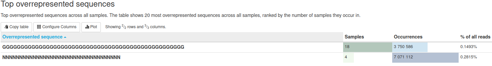

# Project_2

## Table of contents

- [Introduction](#introduction)
- [Workflow and pipeline](#workflow-and-pipeline)
  - [Control quality and trimming](#control-quality-and-trimming)
    - [FastQC](#fastqc)
    - [MultiQC](#multiqc)
    - [Trimmomatic](#trimmomatic)
  - [Mapping](#mapping)
  - [Detection of alternative splicing events](#detection-of-alternative-splicing-events)
  - [Results representation](#results-representation)
- [Results](#results)
- [Challenges](#challenges)
  - [Reads Quality](#reads-quality)
  - [Alignment](#alignment)
  - [BHK Contaminant](#bhk-contaminant)
- [Conclusion](#conclusion)
- [References](#references)
- [Contacts](#contacts)


***

## Introduction

To respond to the question asked by project leaders, we have set up a RNAseq analysis pipeline. This workflow is composed of classical steps in RNA sequencing analysis. To do that, we looked at several studies (REFFFFFS) and their different steps in RNAseq analysis to understand how we could apply these steps to our biologic problem. This led us to establish first a pipeline (Cf Workflow and pipeline), supposed to highlight alternative splicing events in data provided. For simplicity and better efficacy, we have concentrated our efforts and work on one condition first. It corresponds to pDC’s RNA only. We discard for now, pDC+BHK condition because it required a higher step of data cleaning and preprocessing to be analyzed properly. Indeed, it’s necessary to remove contaminant BHK’s RNA from pDC’s RNA. So we concentrate here on the condition RNA of pDC only, because it is way more simple. Furthermore, we have performed the following pipeline on a reduced dataset of this condition. That’s right, datafiles are very heavy and contain a lot of information. So, with advices of our project tutor, Mr Lacroix, we run the pipeline on the first 10 000 reads of each files of this condition. It allows us to test and find the best commands for each tool without spending too much computing time.

***

## Workflow and pipeline

### Control quality and trimming

#### FastQC

In order to look at the quality of sequencing file before any further investigation, we’ve controlled reads quality for each file.

- Command line:

```
fastqc --noextract input_file_R1.fastq.gz input_file_R2.fastq.gz
```
- Arguments:
  - `--noextract` : Keep input file in .gz format to ease data manipulation during the pipeline


#### MultiQC

After inspecting each file with fastqc, we have resumed fastqc analysis with a multiqc to have a global view of the dataset provided. We gathered .fastqc reports in one directory: 

- Command line:

```
multiqc .
```

#### Trimmomatic

As shown with fastqc/multiqc reports, a high proportion of adapters is present in reads. We need to trim these adapters. To do these steps we have chosen Trimmomatic tools. Command line can contains a lot of options allowing to highly personalized command line.

- Command line:
```
trimmomatic PE -threads 30 input_R1.fastq.gz input_R2_.fastq.gz output_R1_TrimmedPaired.fastq.gz output_R1_TrimmedUnpaired.fastq.gz output_R2_TrimmedPaired.fastq.gz output_R2_TrimmedUnpaired.fastq.gz ILLUMINACLIP:directory/to/adapters/TruSeq3-PE.fa:2:30:10:11:true
```


- Arguments:
  - `PE`: Indicate to Trimmomatic to treat input file as Paired End (PE) data.
  - `output`: 4 different file names must be provided to store trimmed reads according to input files (R1 or R2) and according to their processing by trimmomatic. For one input paired read, Trimmomatic can keep after trimming, the both reads (TrimmedPaired) or only one reads, orphan reads, because the quality of his mate is very too low (TrimmedUnpaired).
  - `ILLUMINACLIP`: Specified step to remove Illumina adapters.
    - `TruSeq3-PE.fa`: fasta file containing adapters sequences to remove.
    - `seed mismatches = 2`: Maximum mismatches allowed for adapters.
    - `palindrome clip threshold = 30`: Minimum matches allowed between both reads of one pair for adapters clipping.
    - `simple clip threshold = 10`: Minimum matches allowed in one read for adapters clipping.
    - `minAdapterLength = 11`: Minimum length of adapters for clipping.
    - `KeepBothRead = True`: Avoid orphans reads and keep reads pair even if one of them is bad quality or too short. Bad reads will be removed anyway by mapping in further steps. Most mapping tools can’t handle unpaired reads. With this option, next step will be facilitated.


After this trimming step, we performed another fastqc/multiqc analysis to verify that all adapters have been removed and quality of reads are enough to perform mapping.


### Mapping

To map reads, we have used STAR. This is a splice-aware mapping tool. It can map RNAseq derived reads to a reference genome and consider reads matching on exons between introns.

- Command line:

```
STAR --runThreadN 8 --genomeDir hg38_StarIndex --sjdbGTFfile hg38_annotations.gtf --readFilesCommand gunzip -c --readFilesIn input_R1_TrimmedPaired.fastq.gz input_R2_TrimmedPaired.fastq.gz --outSAMtype BAM SortedByCoordinate --quantMode GeneCounts --outFileNamePrefix [label]
```


- Arguments:
  - `--genomeDir`: Path to the genome index created with STAR. We work here with the hg38 Homo Sapiens genome.
  - `-sjdbGTFfile`: Path to the annotation file (GTF). As the genome is hg38 version, we have provided here the GTF file associated to the hg38 genome.
  - `--readFilesCommand gunzip -c`: This allows STAR to read fastq.gz files without uncompressing the file, and eases their manipulation.
  - `--outSAMtype BAM SortedByCoordinate`: STAR output will be in .bam format and alignments ordered by their coordinates.
  - `--quantMode GeneCounts`: Option specified to STAR to output an additional file where counts are saved for each gene presenting a read alignment.
  - `--outFileNamePrefix [label]`: Add a label for the file to have consistent naming.


### Detection of alternative splicing events

To analyze splicing events, we use a popular tool: rMATS. This tool will use reads aligned by STAR and search for differences in different types of alternative splicing events between 2 conditions (skipping exon, alternative 3’ and 5’ alternative splicing sites, mutually exclusive exons, and intron retention).

- Command line:

```
 rmats.py --b1 bam1.txt --b2 bam2.txt --gtf hg38_annotations.gtf -t paired --nthread 25 --od . --tmp tmp/ --variable-read-length --readLength 100
```

- Arguments:
  - `--b1 / --b2`: These are .txt files containing paths to .bam files. Replicates were separated by a “,”.
  - `--gtf`: Path to the .gtf annotation file used during the mapping step with STAR.
  - `-t paired`: Specify to rMATS that data are paired-end.
  - `--readLength 100`: Indication to rMATS to estimate reads length for the calculation of inclusion of junction reads and other parameters.
  - `--variable-read-length`: Allow reads to have a length that differs from the --readLength option. This is the case here because trimming output different length for our reads.


### Results representation

rmats2sashimiplot is an extension of rMATS that uses rMATS outputs and represents splicing events with a Sashimi plot.

- Command line:

```
rmats2sashimiplot -o output_directory --l1 7010 --l2 7014 --event-type SE -e SE.MATS.JCEC.txt --b1 bam1.sortedByCoord.out.bam --b2 bam2.sortedByCoord.out.bam
```

- Arguments:
  - `--l1 / --l2`: Add a label to results samples.
  - `--event-type SE`: Specify the type of event to represent. SE means “Skipping Event.”
  - `-e`: Path to the rMATS output file associated with the type of event.
  - `--b1 / --b2`: Path to .bam files output by STAR.

***

## Results

- Liste de gène différentiellement épissé
- Petite étude biologique de un ou certains gènes inpliqué dans la biologie des pDC

***

## Challenges

### Reads Quality

By looking at raw data with the FastQC tool, we have seen really interesting features. Indeed, we have found, in several files, overexpressed sequences that seem to correspond to poly guanine expression. Here an example : 




Despite several research on other RNAseq studies, we didn’t find any similar overexpressed sequences. We hypothesize that it comes from some problems during the sequencing step. In addition, we found a high amount of adapters in reads. This brought us to trim a lot of information in reads and shorten high amounts of reads. This could be problematic in the way that information contained in reads can be lost.


Parler du fait que le poly G à la fin est chelou


Parler du fait que les adaptateurs vont vachement loin dans le reads ==> Trimming intense Cf section suivante


### Alignment 

As a result of very short reads generated by the trimming step, numerous reads have not been mapped to the human genome. A very high percentage was “unmapped because too short” according to STAR. This could compromise further investigation and reduce our statistical power to detect rare events like alternative splicing events. 


### BHK Contaminant

In the condition, pDC+BHK, we want to see if pDC in direct contact with BHK (infected or non infected cells) could lead to different alternatives splicing events. BHK are cells that come from hamster species (nom de l'espèce). However, in order to perform analysis, we need first to remove some of BHK contaminants transferred to pDC during the contact. Indeed, during the interferogenic synapse, some RNA of BHK could be transferred to the pDC and contaminate the RNA of pDC. A solution to discard these RNA is to mapped these mixed RNA (pDC and BKH) on the hamster genome to remove all reads that mapped on this genome and so, corresponding to contaminants RNA. Then we use the dataset pDC+BKH separated from BHK originated reads, and pursue the pipeline established. This is necessary if we don’t want to be biased and wrongly allocate expression of genes from BHK to pDC. THis could interfere with conclusions. 

***

## Conclusion

***

## Contacts

For more informations, please contact ariane.paradan@etu.univ-lyon1.fr ; rayann.larbi@etu.univ-lyon1.fr and jordan.dutel@etu.univ-lyon1.fr


***

## Ressources

- [FastQC](https://www.bioinformatics.babraham.ac.uk/projects/fastqc/ "FastQC site")
- [MultiQC](https://multiqc.info/ "MultiQC site")
- [STAR](https://github.com/alexdobin/STAR "STAR GitHub")
- [rMATS](https://github.com/Xinglab/rmats-turbo "rMATS-turbo GitHub")
- [rMATS2sashimiplot](https://github.com/Xinglab/rmats2sashimiplot "rMATS2sashimiplot GitHub")


