# Bio-informatic Project_2

## Table of contents

- [Introduction](#introduction)
  - [Context](#context) 
  - [Dataset description](#dataset-description) 
  - [Aims of this project](#aims-of-this-project)
- [Preliminary Analysis](#preliminary-analysis)
  - [GO Diagram](#go-diagram)
  - [Principal Component Analysis (PCA)](#principal-component-analysis-pca)
    - [PCA on transcript counts](#pca-on-transcript-counts)
    - [PCA on expressed gene counts](#pca-on-expressed-gene-counts)
  - [Fastq Screen](#fastq-screen)
  - [Quality Control](#quality-control)
- [Pipeline](#Pipeline)
  - [Quality control and trimming](#1-quality-control-and-trimming)
    - [FastQC](#11-fastqc)
    - [MultiQC](#12-multiqc)
    - [Trimmomatic](#13-trimmomatic)
  - [Mapping](#2-mapping)
  - [Detection of alternative splicing events](#3-detection-of-alternative-splicing-events)
  - [Results representation](#4-results-representation)
- [Results](#results)
  - [Mapping](#mapping)
  - [rMATS](#rmats)
- [Functional analysis](#functional-analysis)
- [Conclusion](#conclusion)
- [Contributors and Contacts](#contributors-and-contacts)
- [Ressources](#ressources)
- [References](#references)

***

## Introduction

### Context

Since the last few decades, urban expansion and human activities have led humans to interact with more and more species that we have ever face yet. This interaction with different species shows us that zoonoses (like virus CoVID19) can appear. So, understanding immune system mechanisms, especially in the context of viral infection have become a public health issue. In human species, viral infections are mostly managed by immune cells called plasmacytoid dendritic cells (pDC). Thoses cells are huge producers of type 1 interferon, a very efficient alarming cytokine that put cells in a virus-aware state, ready to resist viral infection [[1]](https://www.ncbi.nlm.nih.gov/pmc/articles/PMC10298684/). Several other proteins are synthetised by pDC, and this will allow a very specific immune response against the virus. Thus, in context of viral infection, these proteins produced by pDC are essential and so, really regulated. Among these regulatory mechanisms, alternative splicing remodeling could explain how pDC can adapt their response according to the virus they face. Such mechanisms have already been showned in other immune cells [[2]](https://pubmed.ncbi.nlm.nih.gov/34905508/) [[3]](https://www.ncbi.nlm.nih.gov/pmc/articles/PMC7230527/) [[4]](https://www.ncbi.nlm.nih.gov/pmc/articles/PMC7912025/), but as of now, mechanisms in pDC aren't well known.

### Dataset description

In order to see if pDC presents alternative splicing remodeling in the context of viral infection, we have in our possession a full dataset of RNA sequencing of pDC, following different conditions of stimulation. We use here Baby Hamster Kidney (BHK) cells infected with Dengue virus. Here, BHK cells are necessary to activate pDC, as pDC can't be directly infected by virus (due to its high proportion of type 1 interferon produced). One set of samples are RNA from pDC activated by direct interaction with infected BHK cells via the formation of an interferogenic synapse [[5]](https://pubmed.ncbi.nlm.nih.gov/31003939/). The other set of samples are RNA from pDC activated by indirect interaction with the culture medium of infected BHK cells. For each set of samples, there is also a non-infected condition (pDC interaction (direct or indirect) with a non-infected BHK cells) and a control condition (no interaction (direct or indirect) between pDC and BHK cells). Moreover, the non-infected condition is not the same as the control condition. With these 2 separated conditions, we will be able to discard any effect of pDC-BHK interaction itself (regardless of the infection state of BHK cells) on the alternative splicing, which could create bias in our analysis. Finally, for every condition, we have several biological replicates. Some of them are from a 2020 experiment but the majorirty of the samples are from a 2023 experiment.

Here is a summary scheme:  
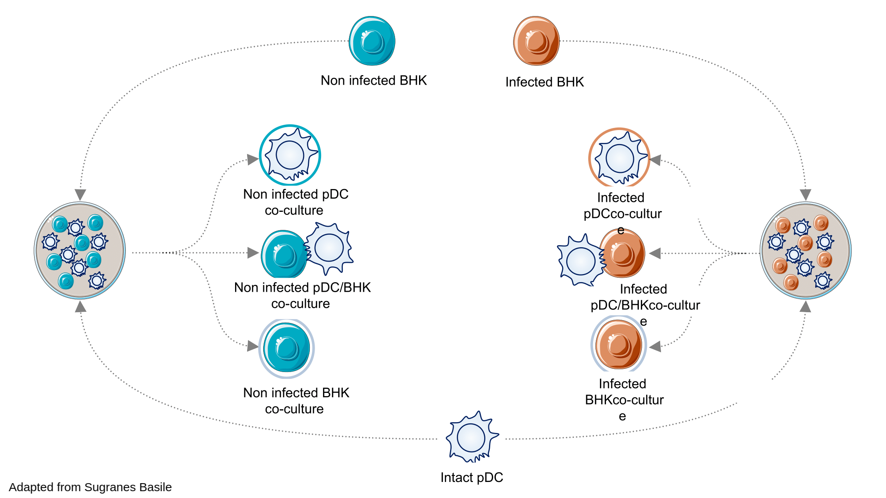


### Aims of this project

Questions raised for the project are:

1. Are the quality and depth of the dataset sufficient to detect signals of differential alternative splicing between conditions?

And if so:

2. Is there alternative splicing remodelling between conditions? And which transcripts are concerned?


To respond to these question asked by our project leaders, we have set up a complete RNAseq analysis pipeline. But before that, we have performed advanced preliminary analysis.


***
## Pipeline

Following the preliminary analyses, we conducted the full pipeline. First, we performed trimming of adapters and poor-quality reads using the Trimmomatic tool. These cleaned reads were then mapped against the human genome via a splice-aware mapper, STAR. Afterwards, these mapped reads were given to rMATS, a software for detecting alternative splicing events. rMATS outputs different types of events, and we have visualized all of this with various tools such as IGV and rmats2sashimiplot.

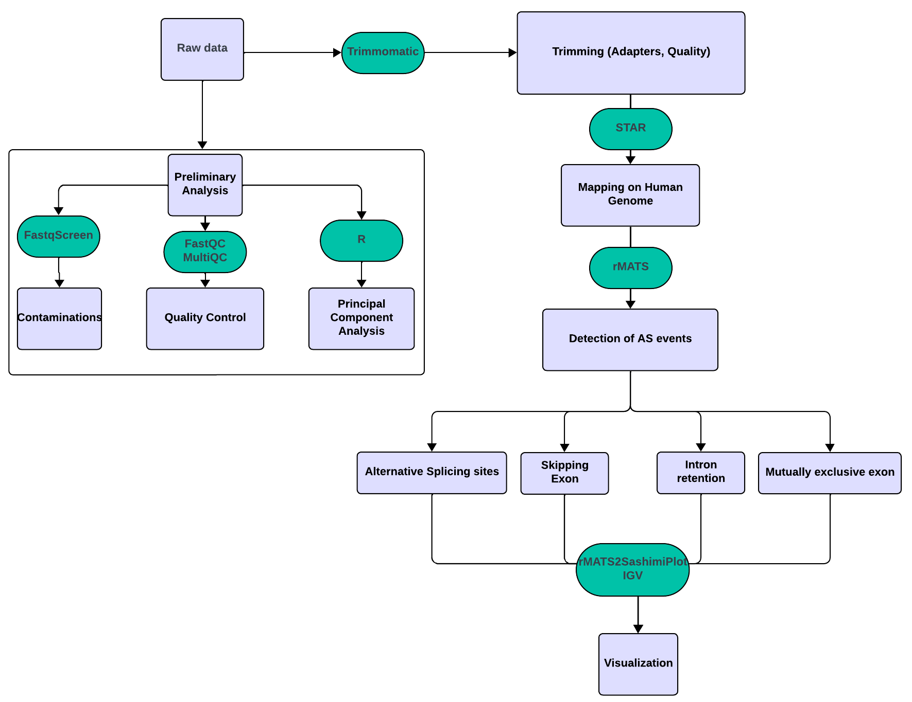

### 1. Quality control and trimming

#### 1.1. FastQC

In order to look at the quality of sequencing file before any further investigation, we’ve controlled reads quality for each file.

- ***Command line:***

```
fastqc --noextract input_file_R1.fastq.gz input_file_R2.fastq.gz
```
- ***Arguments:***
  - `--noextract` : Keep input file in .gz format to ease data manipulation during the pipeline


#### 1.2. MultiQC

After inspecting each file with fastqc, we have resumed fastqc analysis with a multiqc to have a global view of the dataset provided. We gathered .fastqc reports in one directory: 

- ***Command line:***
```
multiqc .
```

#### 1.3. Trimmomatic

As shown with fastqc/multiqc reports, a high proportion of adapters is present in reads. We need to trim these adapters. For this step we have chosen Trimmomatic tools. Command line offers a lot of options, allowing for highly personalized command line.

- ***Command line:***
```
trimmomatic PE -threads 30 input_R1.fastq.gz input_R2_.fastq.gz output_R1_TrimmedPaired.fastq.gz output_R1_TrimmedUnpaired.fastq.gz output_R2_TrimmedPaired.fastq.gz output_R2_TrimmedUnpaired.fastq.gz ILLUMINACLIP:directory/to/adapters/TruSeq3-PE.fa:2:30:10:11:true
```


- ***Arguments:***
  - `PE`: Indicate to Trimmomatic to treat input file as Paired End (PE) data.
  - `output`: 4 different file names must be provided to store trimmed reads according to input files (R1 or R2) and according to their processing by trimmomatic. For one input paired read, Trimmomatic can keep after trimming, the both reads (TrimmedPaired) or only one reads, orphan reads, because the quality of his mate is very too low (TrimmedUnpaired).
  - `ILLUMINACLIP`: Specified step to remove Illumina adapters.
    - `TruSeq3-PE.fa`: fasta file containing adapters sequences to remove.
    - `seed mismatches = 2`: Maximum mismatches allowed for adapters.
    - `palindrome clip threshold = 30`: Minimum matches allowed between both reads of one pair for adapters clipping.
    - `simple clip threshold = 10`: Minimum matches allowed in one read for adapters clipping.
    - `minAdapterLength = 11`: Minimum length of adapters for clipping.
    - `KeepBothRead = True`: Avoid orphans reads and keep reads pair even if one of them is bad quality or too short. Bad reads will be removed anyway by mapping in further steps. Most mapping tools can’t handle unpaired reads. With this option, next step will be facilitated.


After this trimming step, we performed another fastqc/multiqc analysis to verify that all adapters have been removed and quality of reads are enough to perform mapping.


### 2. Mapping

To map reads, we have used STAR. This is a splice-aware mapping tool. It can map RNAseq derived reads to a reference genome and consider reads matching on exons between introns.

- ***Command line:***

```
STAR --runThreadN 8 --genomeDir hg38_StarIndex --sjdbGTFfile hg38_annotations.gtf --readFilesCommand gunzip -c --readFilesIn input_R1_TrimmedPaired.fastq.gz input_R2_TrimmedPaired.fastq.gz --outSAMtype BAM SortedByCoordinate --quantMode GeneCounts --outFileNamePrefix [label]
```


- ***Arguments:***
  - `--genomeDir`: Path to the genome index created with STAR. We work here with the hg38 Homo Sapiens genome.
  - `-sjdbGTFfile`: Path to the annotation file (GTF). As the genome is hg38 version, we have provided here the GTF file associated to the hg38 genome.
  - `--readFilesCommand gunzip -c`: This allows STAR to read fastq.gz files without uncompressing the file, and eases their manipulation.
  - `--outSAMtype BAM SortedByCoordinate`: STAR output will be in .bam format and alignments ordered by their coordinates.
  - `--quantMode GeneCounts`: Option specified to STAR to output an additional file where counts are saved for each gene presenting a read alignment.
  - `--outFileNamePrefix [label]`: Add a label for the file to have consistent naming.


### 3. Detection of alternative splicing events

To analyze splicing events, we use a popular tool: rMATS. This tool will use reads aligned by STAR and search for differences in different types of alternative splicing events between 2 conditions (skipping exon, alternative 3’ and 5’ alternative splicing sites, mutually exclusive exons, and intron retention).

- ***Command line:***

```
 rmats.py --b1 bam1.txt --b2 bam2.txt --gtf hg38_annotations.gtf -t paired --nthread 25 --od . --tmp tmp/ --variable-read-length --readLength 100
```

- ***Arguments:***
  - `--b1 / --b2`: These are .txt files containing paths to .bam files. Replicates were separated by a “,”.
  - `--gtf`: Path to the .gtf annotation file used during the mapping step with STAR.
  - `-t paired`: Specify to rMATS that data are paired-end.
  - `--readLength 100`: Indication to rMATS to estimate reads length for the calculation of inclusion of junction reads and other parameters.
  - `--variable-read-length`: Allow reads to have a length that differs from the --readLength option. This is the case here because trimming output different length for our reads.


### 4. Results representation

rmats2sashimiplot is an extension of rMATS that uses rMATS outputs and represents splicing events with a Sashimi plot.

- ***Command line:***

```
rmats2sashimiplot -o output_directory --l1 7010 --l2 7014 --event-type SE -e SE.MATS.JCEC.txt --b1 bam1.sortedByCoord.out.bam --b2 bam2.sortedByCoord.out.bam
```

- ***Arguments:***
  - `--l1 / --l2`: Add a label to results samples.
  - `--event-type SE`: Specify the type of event to represent. SE means “Skipping Event.”
  - `-e`: Path to the rMATS output file associated with the type of event.
  - `--b1 / --b2`: Path to .bam files output by STAR.

***


## Preliminary Analysis

### GO Diagram

According to the [Gene Ontology Consortium](https://geneontology.org/) “The Gene Ontology (GO) describes our knowledge of the biological domain with respect to three aspects: Molecular Function, Cellular Component, Biological Process”. GO applied to our data could be an excellent method to see if the sequencing and genes expressed in our dataset assess well the biology of pDC cells. To achieve this, for one of the replicate files, we have taken gene counts output by STAR, sorted genes by their abundance and we have compiled in a list the first 50.000 most expressed gene ID. After that, we have used [GOrilla](https://cbl-gorilla.cs.technion.ac.il/), a web application capable of translating gene ID into GO terms and identify enriched GO terms in this list. GOrilla outputs a graph that sums up the biology process, molecular functions and cellular component, captured by the sequencing. To run GOrilla we have indicated that the organism species is “Homo Sapiens”, the gene ID list is a “Single ranked list of genes”, that we wanted to see “All” ontology with P-value not higher than 10⁻³.

Here is the full GO diagram:


Here are some zoom of GO diagram:
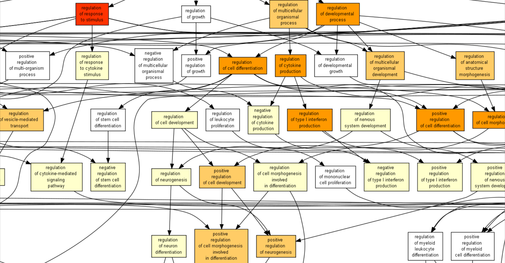
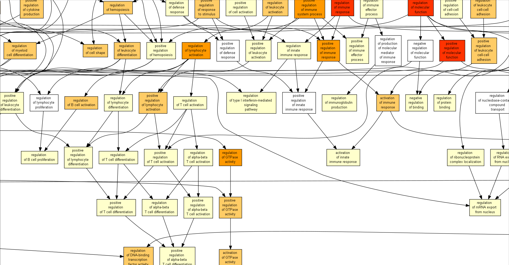
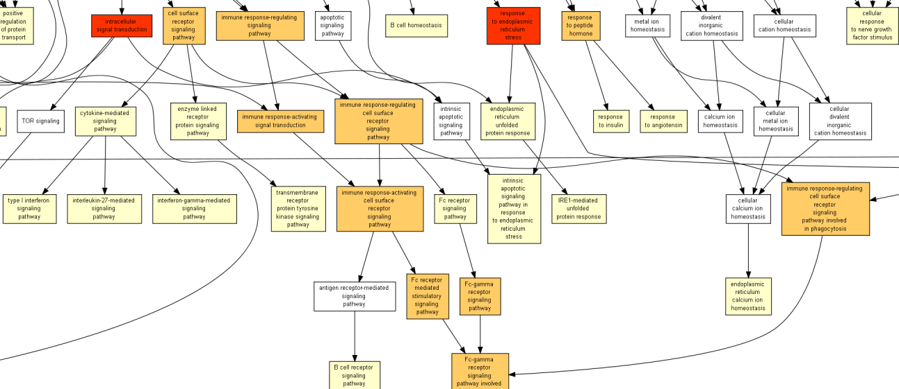

We can see that most parts of the diagram represent the immune process. As a matter of fact, we can find some Gene Ontology corresponding to "regulation of type 1 interferon production", "activation of innate immune response", "cytokine-mediated signaling pathway", "immune response-regulating cell surface receptor signaling pathway"...
These terms tend to refer to functions found in pDC (type 1 interferon signaling and cytokine signaling)

This GO diagram comforts us with the idea that reads sequenced seems to be representative and reflect well the biology of pDC. We don't see here a bias in our dataset.  

### Principal Component Analysis (PCA)

#### PCA on transcript counts

In order to identify signals in our dataset, we have performed a Principal Component Analysis (PCA) on the count of each transcription in the different conditions. To do that, we began by doing a pseudo-alignment with [Kallisto](https://pachterlab.github.io/kallisto/) for each condition with the quant mode activated in order to collect all transcripts counts. Pseudo-alignement was performed on the human transcriptome from Ensembl.
After that, with R, we gathered all abundance.tsv files and preserved only “target_id” and “tpm” columns. Only transcripts with a TPM > 0.5 were preserved to filter out low-expression transcripts. This treshold is arbitrary, there is no perfect threshold, but with some research in the bioinformatics community and forum, we have concluded that the chosen threshold is sufficient to remove low transcript expression. We then merge all abundance files for each replicate by their identical target_id and NA values were replaced by 0. Finally, we use the R function “prcomp” in R, to perform the PCA on transcript.

The PCA can be seen here: 

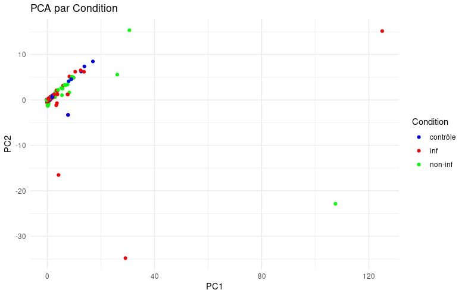

As we can see in the figure, all points are clustered together. It is impossible to distinguish and separate the different conditions from each other. This could be interpreted as a lack of signal in our data between conditions. However, we must take these results with precaution. It may be that our PCA on transcripts was not well executed, or something that we didn’t understand or notice could lead to these specific results. It is difficult to have a clear conclusion and further analysis need to be done to confirm that there is no signal in our dataset, yet this can be a first indication of a sequencing depth too low to see differences between conditions. 

#### PCA on expressed gene counts

pDC without BHK:  
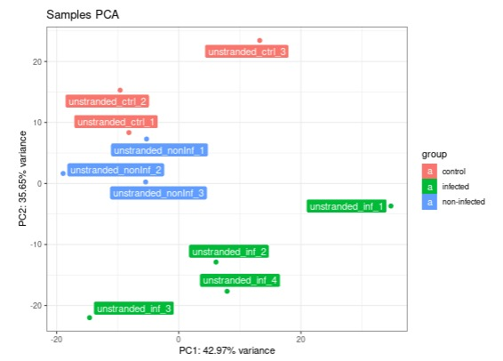

pDC with BHK:  
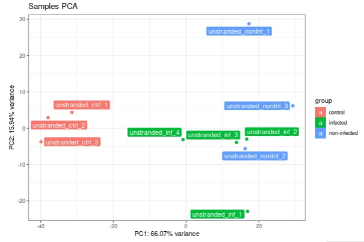

Unlike PCA on transcript counts, PCA on expressed gene counts does show differential clusterization between conditions, which can be interpreted as a signal. Two things are to note however:
- In both the pDC samples and pDC+BHK samples, the inf_1 element deviates from the rest of the condition, which could imply it is abherrant.
- In the pDC+BHK samples, the non_inf condition does not clusterize properly. This may indicate a serious variability issue in the condition itself.

### Fastq Screen

BHK Contaminant

Finally, in the condition, pDC+BHK, we want to see if pDC in direct contact with BHK (infected or non infected cells) could lead to different alternatives splicing events. BHK are cells that come from hamster species _Mesocricetus auratus_. However, in order to perform analysis, we need first to remove some BHK contaminants transferred to pDC during the contact. Indeed, during the interferogenic synapse, some RNA of BHK could be transferred to the pDC and contaminate the RNA of pDC. A solution to discard these RNA is to map these mixed RNA (pDC and BKH) on the hamster genome to remove all reads that mapped on this genome, and so, corresponding to contaminants RNA. Then we may use the dataset pDC+BKH separated from BHK originated reads, and pursue the established pipeline. This is necessary if we don’t want to be biased and wrongly allocate expression of genes from BHK to pDC, which could interfere with conclusions. 


##### Interpretation

By looking at raw data with the FastQC tool, we have seen really interesting features. Indeed, reads before trimming seem to have a disproportionate amount of guanine at the 3' end of reads, like shown: 


In the same way, we have found, in several _R2.fastq (reversed reads complementary to forward reads), overexpressed sequences that seem to correspond to poly-guanine expression. Here is an example: 

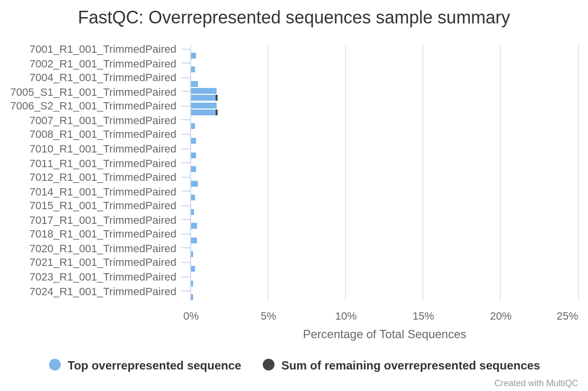


With some research, we have learned that these overexpressed sequences are often found in sequencing data from Illumina sequencers NovaSeq/NextSeq. According to some users on [this](https://www.biostars.org/p/9499939/) BioStar forums, "Poly-G reads represent cluster producing no signal in two-color chemistry" like we found in these sequencers. This information is confirmed as well on [this](https://www.researchgate.net/post/What_can_cause_poly-G_tails_on_NextSeq_fastq_from_seemingly_failed_libraries) ResearchGate forum. We think that may be the reason behind our observations of G content in 3' end and with overexpressed sequences in our data.
On the other side, the overrepresented sequences of "N" can indicate quality issues at certain locations within the sequences. These 2 files come from a previous experiment realized in 2020. This can be observed in the following graph:  

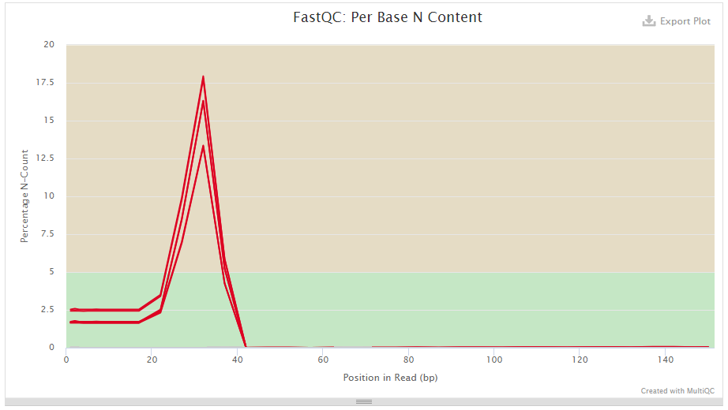

As these overexpressed sequences are not highly expressed in our dataset (only around ~0.20% of total sequences), this will not bias our analysis, and with a trimming step, these sequences will be removed. But it seems important for us to understand from what this can arise from, if this may have an impact on our analysis, and inform project leader that this could probably happen in their next analysis.

Moreover, on all of the .fastq files, as we can see on the picture below, there is a high amount of adapters even in the middle of reads. 

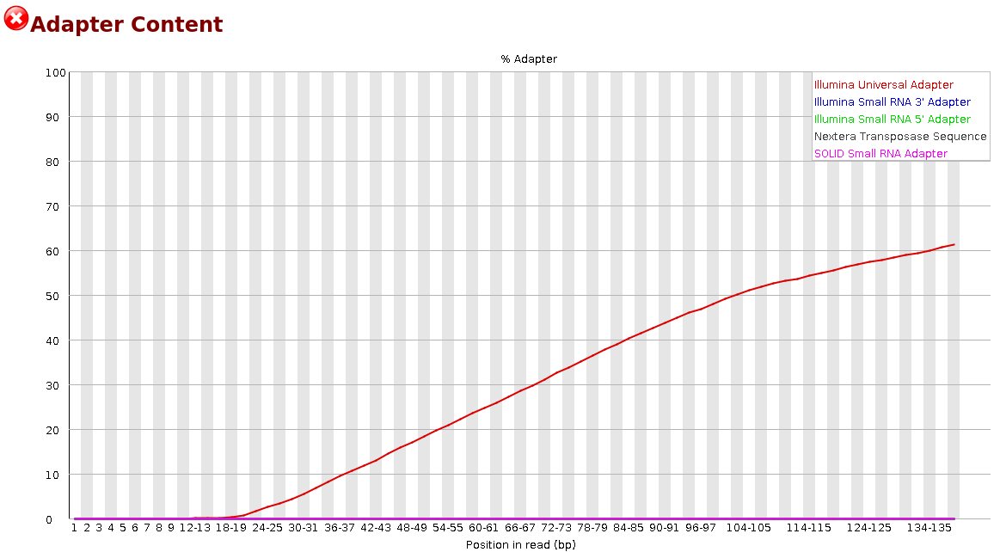

As presented in the next section, this has caused problems during the trimming steps and later for the alignement with STAR, because reads have been severly truncated with trimming steps, and this lead to a lot of very short reads.

We have also found sequences with a heightened level of duplication:  

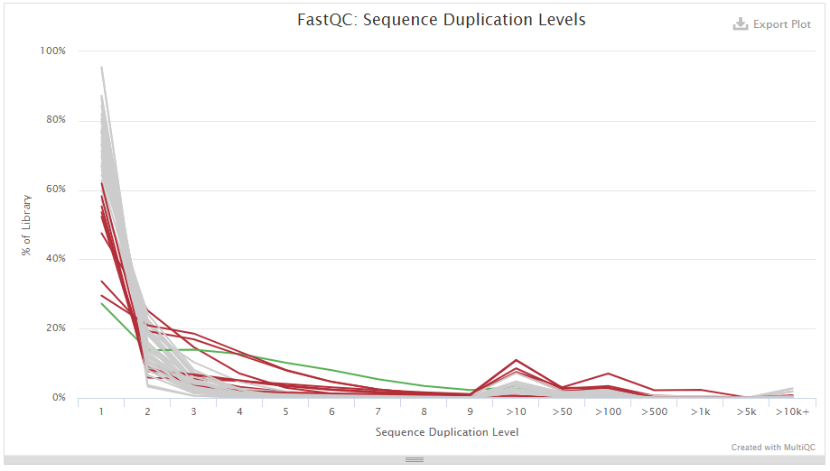

These sequences all belong to the same condition: the non-infected pDC+BHK condition. Considering that our previous PCA plot showed a lack of clusterization, it is possible that this condition presented some issues in the sequencing.

Overall, we learned two important facts about our dataset during this step. The first is that the 2020 samples cannot be used because of their differences with the 2023 dataset, which creates excess variability. The second is that the non-infected pDC+BHK condition is unexploitable because of the duplication levels. We must take this into account for the following steps.


 ***


## Results
### Mapping

 

As a result of very short reads generated by the trimming step, numerous reads have not been mapped to the human genome. A very high percentage was “unmapped because too short” according to STAR. 


This is a problem because it could compromise further investigation and reduce the depth of the sequencing because we have lost a lot of information during trimming step. This is even more problematic when we know that to detect rare events like alternative splicing events, the sequencing depth must be much higher than for classic differential gene expression. 

Nevertheless, for data with direct activation, the alignment scores are aroud 50% and homogeneous between samples, which is satisfactory for further analysis. 
For data with indirect activation, one of the main difficulties was to sort reads from hamster BHK cells and human pDC cells' reads. Our first approach was to create a concatenated index of the human and hamster genomes and map the reads onto it. This would have enabled us to perform a fairer sort and subsequently maximize the mapping of pDC reads to the human genome. Unfortunately, due to material limitations, this track could not be fully tested.
In the end, we mapped these reads onto the human genome, hoping that the evolutionary distance between hamster and human would be long enough for the hamster reads not to be able to map onto each other and sort them this way. The results for this approach are that alignment scores are highly variable between samples (10% to 50%), and in some cases very low, making downstream analysis more complicated. This is probably due to the fact that the proportion of hamster reads is highly variable between samples, and overall much higher than the number of human reads (visible on the FastQ Screen).

### rMATS

RMATS gives us a list of exons for each possible alternative splicing event. 

For data with indirect activation, the first step was to sort these out so that they were significant. To do this, we used 2 criteria: a false discovery rate (FDR) below the 5% threshold and an inclusion difference level greater than 0.5. The second step was to select the significant exons specifically linked to infection. To do this, we performed an RMATS analysis between control and uninfected conditions to obtain an A-list of differentially spliced genes. We then performed an RMATS analysis between control and infected conditions to obtain a B-list of differentially spliced genes. The final candidate gene list is list B without the elements of list A. 

For data with direct activation, as the uninfected experimental condition is not usable (probably due to a sequencing problem detected in the quality analysis step) we have restricted ourselves to performing an RMATS analysis between the control and infected conditions and filtering the significant exons from the rmats output. The list of candidate genes obtained is a list of differentially spliced genes, but we can't say whether these differential splicing events are linked to infection.

Here is a table summarizing the lists of candidate genes obtained:

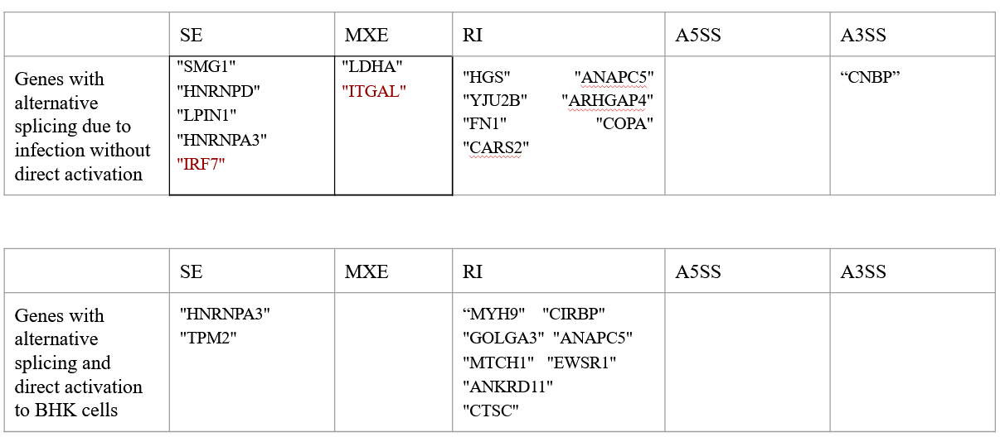

It should be noted that the IRF7 gene is already known in the literature to be involved in IFN pathway modulation, so it's reassuring to find it here.


***
## Functional analysis


ITGAL is an integrin and is therefore involved in the establishment of interferogenic synapses. But it is also essential for immune system processes such as leukocyte lesioning at the endothelium and T-cell cytotoxicity. It is also involved in lymphopoiesis (i.e. all the successive stages of differentiation of immune cells in the bone marrow).[[6]](https://www.uniprot.org/)

IRF7 is a transcriptional regulator and is involved in all type I interferon (IFN)-dependent immune responses. More generally, it has a critical role in innate immune defense against DNA and RNA viruses. Indeed, when there is a viral infection or signaling by TLRs (Toll-like receptors), IRF7 is phosphorylated, dimerized and will localize at the level of the nucleus where it can regulate gene expression.[[6]](https://www.uniprot.org/)

The other genes present in the candidate gene lists encode non-coding RNAs. However, they are interesting because some of them encode RNAs involved in the functioning of the protein machinery carrying out alternative splicing. thus they can have an effect on the alternative splicing of a gene but indirectly (like HNRNPD or ARHGAP4). [[6]](https://www.uniprot.org/)

***
## Conclusion

We have indeed managed to identify at least two interesting, differentially spliced genes in IRF7 and ITGAL. However, while we do obtain a signal from our data, the resulting list of genes is very short. This could be corrected by increasing quality and strengthening coverage depth to extend the list of detected genes as well as increase our accuracy. This may require a new sequencing, especially of the pDC+BHK condition, which was troublesome due to the unexploitable nature of its non-infected samples.

***
## Contributors and Contacts

### **Project contributors**

For more informations, please contact :  
- Ariane Paradan (ariane.paradan@etu.univ-lyon1.fr)  
- Rayann Larbi (rayann.larbi@etu.univ-lyon1.fr)  
- Jordan Dutel (jordan.dutel@etu.univ-lyon1.fr)  

Master Bioinfo@Lyon


### **Project leaders**

Delphine Galiana, Team VIV, CIRI (delphine.galiana@ens-lyon.fr)  
Camille Daligault, Team VIV, CIRI (camille.daligault@ens-lyon.fr)

### **Project tutor**

Vincent Lacroix, Team Baobab, LBBE (vincent.lacroix@univ-lyon1.fr)

***

## Ressources

- [FastQC](https://www.bioinformatics.babraham.ac.uk/projects/fastqc/ "FastQC site")
- [MultiQC](https://multiqc.info/ "MultiQC site")
- [FastqScreen](#https://www.bioinformatics.babraham.ac.uk/projects/fastq_screen/)
- [STAR](https://github.com/alexdobin/STAR "STAR GitHub")
- [rMATS](https://github.com/Xinglab/rmats-turbo "rMATS-turbo GitHub")
- [rMATS2sashimiplot](https://github.com/Xinglab/rmats2sashimiplot "rMATS2sashimiplot GitHub")

## References

- [[1]](https://www.ncbi.nlm.nih.gov/pmc/articles/PMC10298684/) Mertowska, Paulina et al. “Immunomodulatory Role of Interferons in Viral and Bacterial Infections.” International journal of molecular sciences vol. 24,12 10115. 14 Jun. 2023, doi:10.3390/ijms241210115
- [[2]](https://pubmed.ncbi.nlm.nih.gov/34905508/) Li, Xiaobo et al. “An alternatively spliced STING isoform localizes in the cytoplasmic membrane and directly senses extracellular cGAMP.” The Journal of clinical investigation vol. 132,3 (2022): e144339. doi:10.1172/JCI144339
- [[3]](https://www.ncbi.nlm.nih.gov/pmc/articles/PMC7230527/) Hurtado-Guerrero, Isaac et al. “Antiviral, Immunomodulatory and Antiproliferative Activities of Recombinant Soluble IFNAR2 without IFN-ß Mediation.” Journal of clinical medicine vol. 9,4 959. 31 Mar. 2020, doi:10.3390/jcm9040959
- [[4]](https://www.ncbi.nlm.nih.gov/pmc/articles/PMC7912025/) Xu, Xiaofang et al. “Alternative mRNA Processing of Innate Response Pathways in Respiratory Syncytial Virus (RSV) Infection.” Viruses vol. 13,2 218. 31 Jan. 2021, doi:10.3390/v13020218
- [[5]](https://pubmed.ncbi.nlm.nih.gov/31003939/) Assil, Sonia et al. “Plasmacytoid Dendritic Cells and Infected Cells Form an Interferogenic Synapse Required for Antiviral Responses.” Cell host & microbe vol. 25,5 (2019): 730-745.e6. doi:10.1016/j.chom.2019.03.005
- [[6]](https://www.uniprot.org/) The UniProt Consortium, UniProt: the Universal Protein Knowledgebase in 2023, Nucleic Acids Res. 51:D523–D531 (2023)


